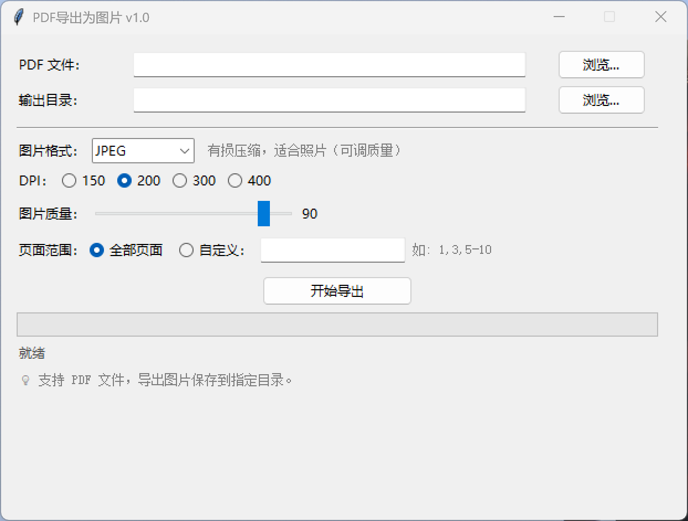

<div align="center">

# 🖼️ PDF导出为图片

**PDF to Image Exporter** — 将 PDF 文件的每一页导出为高清图片


[](https://github.com/Suryxin-xx/PDF2Image/releases)

---

</div>

## 📌 简介

你是否遇到过这些场景？

- 需要从 PDF 中提取图片素材
- 想把 PDF 的每一页拆成独立的图片文件
- 需要将 PDF 转为特定格式（如 JPEG / TIFF）用于打印或发布

这个小工具就是为此而生，**将 PDF 每一页导出为高清图片**，支持多种常见图片格式。

## ✨ 功能特性

| 特性 | 说明 |
|------|------|
| 📄 **PDF 输入** | 支持任何标准 PDF 文件 |
| 🖼️ **5 种图片格式** | PNG / JPEG / TIFF / BMP / WEBP |
| 🎚️ **DPI 可调** | 150 / 200 / 300 / 400 DPI，平衡清晰度与文件大小 |
| ⚙️ **质量调节** | JPEG/WEBP 模式下可自定义压缩质量 |
| 📄 **页面范围选择** | 全部导出 / 自定义页码（如 `1,3,5-10`）|
| ⚡ **双模式运行** | **GUI 图形界面** + **CLI 命令行** |
| 📊 **实时进度** | 进度条 + 当前页码提示 |
| 📂 **一键直达** | 导出完成后直接打开输出文件夹 |

## 🖥️ 截图



*主界面：选择 PDF → 设置格式/DPI/页码 → 开始导出*

## 📦 下载

> 前往 [Releases](https://github.com/Suryxin-xx/PDF2Image/releases) 下载最新版 exe

| 文件 | 说明 |
|------|------|
| `PDF导出为图片_v1.0.zip` | 单 exe 文件，解压即用（推荐） |

**系统要求：** Windows 10/11，64 位

## 🚀 使用方法

### GUI 模式（推荐）

双击运行 `PDF导出为图片.exe`：

1. **选择 PDF** — 点击"浏览"选择文件
2. **选择输出目录** — 图片保存到哪里
3. **选择格式** — PNG / JPEG / TIFF / BMP / WEBP
4. **调节 DPI 和质量** — JPEG/WEBP 时可调质量
5. **选择页面范围** — 全部或自定义
6. **点击导出** — 等待进度条走完

### CLI 模式

```bash
# 基本用法（默认 PNG, 200 DPI）
PDF导出为图片.exe input.pdf

# 指定格式和 DPI
PDF导出为图片.exe input.pdf -f JPEG --dpi 300

# 指定质量（仅 JPEG/WEBP 有效）
PDF导出为图片.exe input.pdf -f JPEG -q 95

# 指定页面范围
PDF导出为图片.exe input.pdf -f TIFF -p 1-5,8,10

# 指定输出目录
PDF导出为图片.exe input.pdf -o D:\my_images
```

## 🔧 从源码运行

```bash
# 1. 克隆仓库
git clone https://github.com/Suryxin-xx/PDF2Image.git
cd PDF2Image

# 2. 安装依赖
pip install -r requirements.txt

# 3. 运行（GUI 模式）
python main.py

# 4. 运行（CLI 模式）
python main.py input.pdf -f JPEG --dpi 300
```

## 🏗️ 技术栈

| 组件 | 用途 |
|------|------|
| [Python](https://www.python.org/) | 编程语言 |
| [PyMuPDF (fitz)](https://pypi.org/project/PyMuPDF/) | PDF 渲染 |
| [Pillow](https://python-pillow.org/) | 图片编码与保存 |
| [tkinter](https://docs.python.org/3/library/tkinter.html) | GUI 界面（内置） |
| [PyInstaller](https://pyinstaller.org/) | 打包为 exe |

## 🗂️ 项目结构

```
PDF2Image/
├── src/                    # 源代码
│   ├── __init__.py
│   ├── converter.py        # 核心转换逻辑
│   └── gui.py              # 图形界面
├── main.py                 # 入口（GUI / CLI 双模式）
├── requirements.txt        # Python 依赖
├── build_exe.ps1           # 打包脚本（需 PyInstaller + UPX）
├── screenshots/            # 截图
├── LICENSE                 # MIT 许可证
└── README.md
```

## 🔨 自行打包

```powershell
# 1. 安装依赖
pip install -r requirements.txt

# 2. 运行打包脚本
.\build_exe.ps1
```

打包后的 exe 位于 `dist/PDF导出为图片.exe`。

## 📄 许可证

本项目使用 [MIT License](LICENSE) — 欢迎 fork、修改、分发。

## 🤝 贡献

有问题或建议？欢迎提交 [Issue](https://github.com/Suryxin-xx/PDF2Image/issues) 或 Pull Request。

---

<div align="center">

**如果这个工具对你有帮助，欢迎 ⭐ Star 支持！**

</div>
